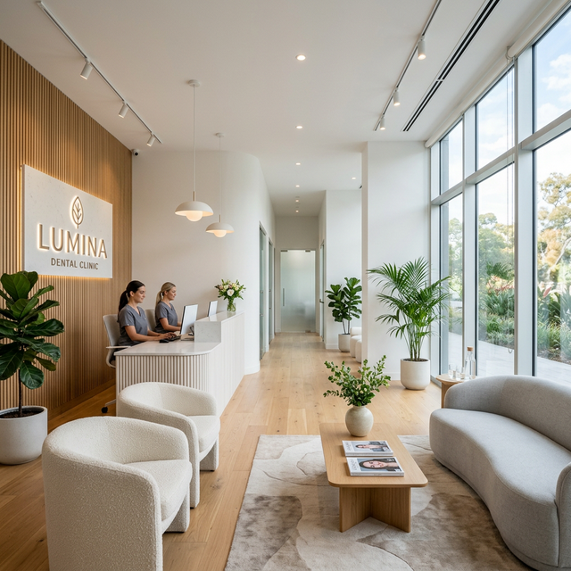

# 🦷 Elite Dental | Premium Private Dentistry



A high-end, "Apple-style" dental clinic website designed for premium healthcare branding and high patient conversion. This project features a sophisticated, modern UI with a focus on clinical precision and tranquility.

## ✨ Premium Features

-   **🍎 Apple-Level Aesthetic**: Minimalist design with ample whitespace, monochromatic gradients, and bold typographic hierarchy.
-   **✨ Smooth Interactivity**: Custom scroll-reveal animations using Intersection Observer for a "fluid" browsing experience.
-   **🖼️ Advanced Gallery**: Modern masonry-style grid with a custom vanilla JavaScript lightbox.
-   **💬 Patient Conversion**: Floating WhatsApp integration, concierge-style booking forms, and sticky navigation.
-   **⚡ Performance First**: Fast-loading assets, clean semantic HTML5, and responsive layouts built with CSS Grid & Flexbox.
-   **📱 Mobile-First**: Completely responsive design tailored for the modern premium patient segments.

## 🚀 Getting Started

### Prerequisites
- [Node.js](https://nodejs.org/) (for the local development server)

### Installation & Running
1.  **Clone the repository:**
    ```bash
    git clone https://github.com/Aravind-2508/Dental.git
    cd Dental
    ```

2.  **Run with NPM (Recommended):**
    ```bash
    npm run dev
    ```
    This will start a local server at [http://127.0.0.1:3000](http://127.0.0.1:3000).

3.  **Run with Command Line:**
    ```bash
    npx -y http-server -p 3000
    ```

4.  **Open in VS Code:**
    Install the [Live Server](https://marketplace.visualstudio.com/items?itemName=ritwickdey.LiveServer) extension and click **"Go Live"**.

## 📂 Project Architecture

```text
├── assets/
│   └── images/       # High-resolution clinical assets
├── css/
│   └── styles.css    # Premium design system & modern layout
├── js/
│   └── main.js       # Advanced UX logic, animations & sliders
├── index.html        # Home Page (High-impact Hero)
├── about.html        # Expertise & Clinical Philosophy
├── treatments.html   # Service Detail Cards
├── gallery.html      # Masonry Clinic Tour
├── contact.html      # Concierge Connect & Booking
└── package.json      # NPM scripts and configuration
```

## 🎨 Design System
-   **Primary Font**: [Plus Jakarta Sans](https://fonts.google.com/specimen/Plus+Jakarta+Sans) (Modern & Elegant)
-   **Heading Font**: [Outfit](https://fonts.google.com/specimen/Outfit) (Bold & Clinical)
-   **Colors**: 
    -   `Primary`: #023E8A (Deep Sea Blue)
    -   `Secondary`: #00B4D8 (Teal Arctic)
    -   `Surface`: #F8F9FA (Luxury Gray)

## 👤 Author
**Elite Dental Practice**
*Global Clinical Excellence*

---

### 🏛️ License
This project is licensed under the ISC License.
